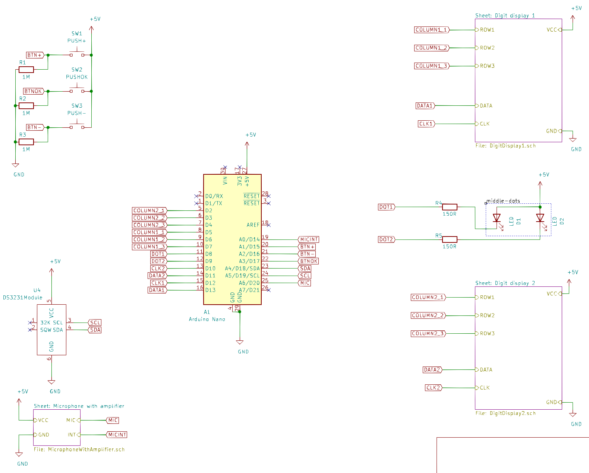
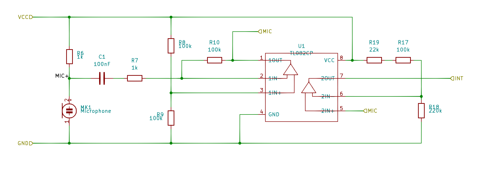
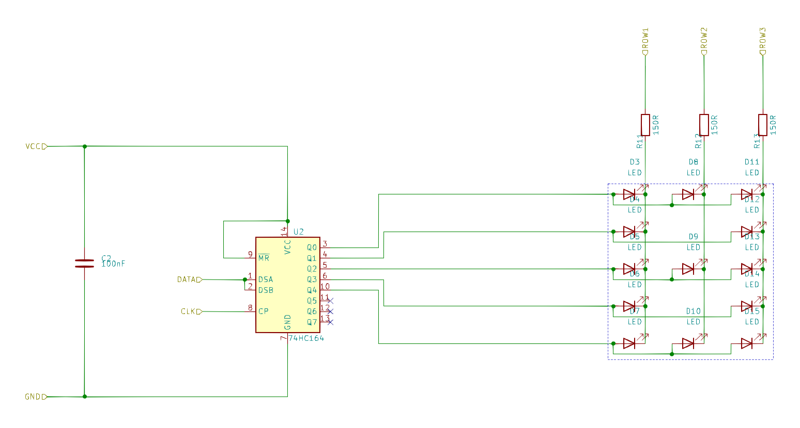
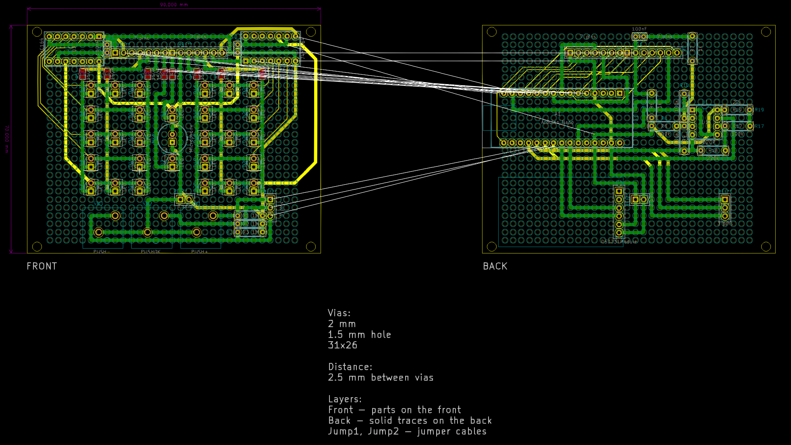
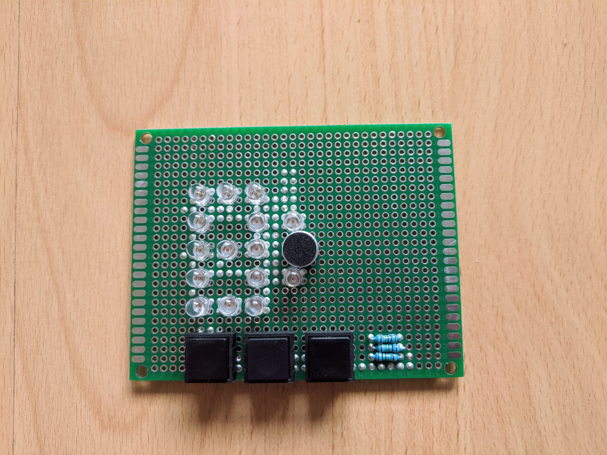
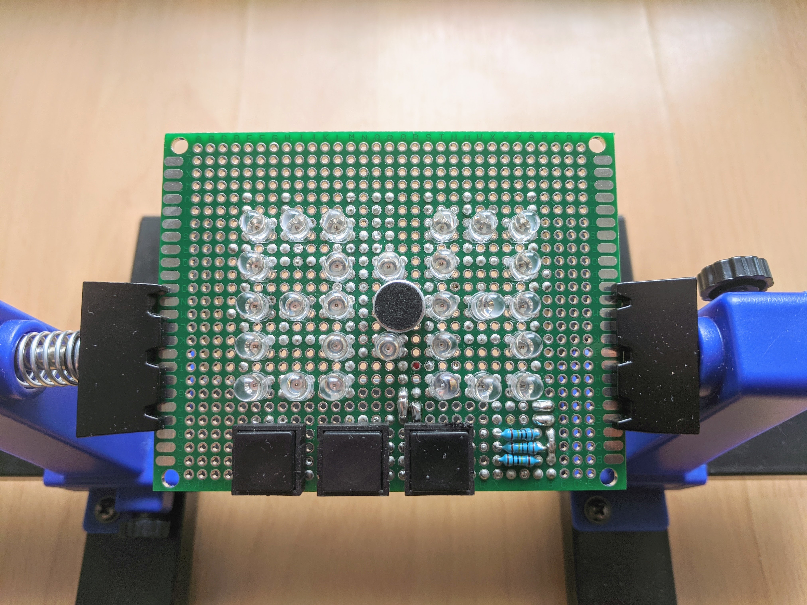
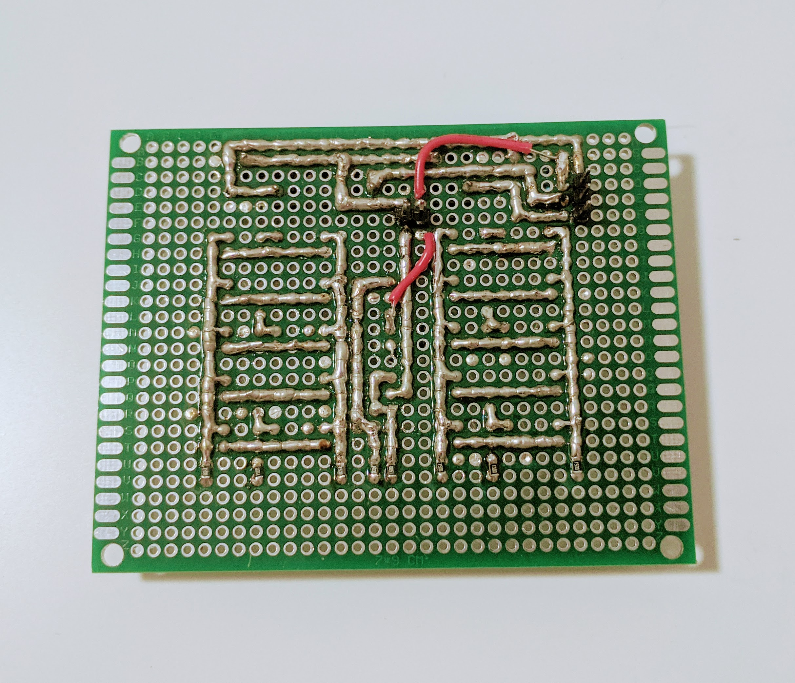

# Night clock

This was my first electronics projects. The goal was to make a "night" clock that would only turn on after clapping. The display was made from orange LEDs to make it suitable for the night.

The project ended up too much for me at the time. I made a proper schematic with all components and designed the PCB layout for a prototype board in KiCad! I used different layers for solder traces and jumper wires. In the end, however, the layout was too complicated and time-consuming. I should have used way more jumper wires, perhaps even utilize wire wrapping wires.

I also did not test the LED display before I started soldering. It later turned out that those 150 ohm resistors were too little and the LEDs were too bright for a night. However, I am very proud that I got the microphone amplifier to work.

All KiCad project files are included in the repository. Here are a few images.

## Schematic

## Pcb

## Photos

I stopped soldering before I could finish the boards. Here are some progress photos.

